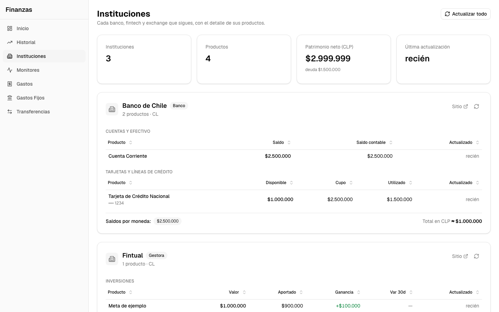

# El Chanchito 🐷

Personal finance tracker for Chilean banks and fintechs: automated scrapers, formula-based monitors, and net-worth history.



<sub>Screenshot with synthetic demo data.</sub>

## Overview

El Chanchito (“the piggy bank”) is a self-hosted personal finance tracker. Python scrapers pull balances and transactions from Chilean financial institutions (Banco de Chile, Tarjeta Lider Bci, Fintual, Buda, MACH, MercadoPago and Tenpo) into PostgreSQL, and a Next.js dashboard turns them into monitors (budget drift and other alerts over your balances), a spending history, and a net-worth timeline. Everything runs locally via the Makefile or Docker Compose, and credentials stay on your machine in the macOS Keychain.

## Highlights

- **Monitors**: an equation over product values (say, the checking balance minus what the cards owe) checked against alert and warning thresholds that can ramp through the month, evaluated live and replayed day by day from balance history.
- **Seven institution scrapers** on independent schedules, mixing REST APIs (Fintual, Buda), browser automation (Playwright for Banco de Chile, a real Chrome over CDP for Tarjeta Lider Bci), and Gmail inbox parsing (MACH, MercadoPago, Tenpo).
- **Typed product registry**: every product kind (checking, credit card, crypto, ...) is declared once in pydantic, grouped into display families with the column specs of their dashboard tables, and code-generated into TypeScript types, a JSON Schema, and per-kind docs.
- **Net worth from snapshots**: derived from per-product snapshot history, with per-kind asset/liability conventions and multi-currency conversion to CLP.
- **On-demand refresh**: an internal control endpoint lets the dashboard trigger a scrape immediately instead of waiting for the next scheduled run.
- **Password-protected dashboard**: one shared password and a signed session cookie; a production build without it fails closed and serves nothing.

## Quickstart

Requires Node.js 20+ with pnpm 9 (`corepack enable`), Python 3.12+ and Docker; see [USAGE.md](USAGE.md#prerequisites).

```bash
git clone https://github.com/fguinez/el-chanchito.git
cd el-chanchito
make install           # Node deps + Python venv + Playwright Chromium
cp .env.example .env   # then fill in your identifiers (see Configuration)
make secrets-init      # store scraper secrets in the macOS Keychain
make dev               # PostgreSQL (port 5435) + migrations + scrapers + dashboard at http://localhost:3000
```

## Usage

The dashboard runs at `http://localhost:3000`: **Inicio** lists the monitors that need attention and the latest scraper runs, **Monitores** every monitor with its history chart, **Historial** the net-worth timeline, **Instituciones** every scraped product with an on-demand refresh button, and **Gastos**, **Gastos Fijos** and **Transferencias** the transactions, recurring expenses and internal transfers.

`make dev` already runs the scraper service. To run the scrapers without the dashboard (not alongside `make dev`: both bind the control port `:8080`):

```bash
make scrapers-once    # run every configured scraper once
make scrapers-start   # long-running, each scraper on its own schedule
make fintual-login    # one-time Fintual sign-in (e-mail 2FA, session cached)
```

A scraper is enabled only when its credentials are present. See [USAGE.md](USAGE.md) for the full guide: scraper setup, dashboard pages, daily and monthly workflows, CSV import, category auto-assignment, deployment, and the API reference.

## Configuration

| Variable | Required | Description |
|---|---|---|
| `DATABASE_URL` | yes | PostgreSQL connection string; the `.env.example` default works with `make db-up` |
| `BANCHILE_RUT` | no | Banco de Chile RUT; enables the BanChile scraper (Playwright) |
| `LIDER_BCI_RUT` | no | Tarjeta Lider Bci RUT; enables its scraper (drives a real Chrome, so it needs a machine with a display) |
| `FINTUAL_EMAIL` | no | Fintual account e-mail; enables the Fintual scraper (run `make fintual-login` once) |
| `EMAIL_IMAP_HOST` / `EMAIL_IMAP_USER` | no | Gmail IMAP identifiers; enable the e-mail parsers (MACH, MercadoPago, Tenpo) |
| `chanchito.*` | scrapers only | Secrets (bank passwords, Buda API keys, Gmail App Password) live in the macOS Keychain: `make secrets-init` / `make secrets-status`. On non-macOS hosts, export them as env vars instead |

`.env.example` documents every other setting the code reads, with its default (e-mail lookback window, Fintual session cache, scraper mode, dashboard login, on-demand refresh wiring).

## Development

```bash
make test        # all tests: vitest (web) + pytest (scrapers)
make typecheck   # tsc --noEmit
make lint        # eslint
make product-model-generate  # regen TS/JSON artifacts after editing the registry
make up          # full stack in Docker (postgres + web + scrapers)
```

## Project structure

```
el-chanchito/
├── apps/
│   ├── web/            # Next.js 16 dashboard (App Router, Drizzle ORM)
│   └── scrapers/       # Python 3.12 scraper service (APScheduler)
├── packages/
│   ├── db-schema/      # Versioned SQL migrations + runner
│   └── product-model/  # Product-kind registry (pydantic → TS/JSON codegen)
├── scripts/            # dev.sh (make dev), load-secrets.sh (Keychain → env)
├── docs/screenshots/   # README screenshot (synthetic data)
├── docker-compose.yml  # postgres + web + scrapers
├── Makefile            # every common task (`make help`)
├── USAGE.md
└── ARCHITECTURE.md
```

## Architecture

A Next.js dashboard and a Python scraper service share one PostgreSQL database: scrapers upsert typed products, snapshots, and transactions, and the dashboard derives monitors and net worth from them. Product kinds are defined once in `packages/product-model` and code-generated into the TypeScript the web app consumes.

For full detail, see [ARCHITECTURE.md](ARCHITECTURE.md).

## Testing

`make test` runs both suites: vitest for the dashboard and pytest for the scrapers. `make test-py` also covers `packages/product-model`, including a codegen drift test that fails if the generated TypeScript/JSON artifacts fall behind the registry.

## Further reading

- [USAGE.md: full user guide (workflows, scraper setup, API reference)](USAGE.md)
- [ARCHITECTURE.md: system design, schema, scrapers, auth](ARCHITECTURE.md)
- [packages/product-model/PRODUCTS.md: generated per-kind product field matrix](packages/product-model/PRODUCTS.md)

## License

Released under the [PolyForm Noncommercial License 1.0.0](LICENSE.md): you may fork, modify, self-host, and use El Chanchito freely for any noncommercial purpose (personal use, hobby projects, research, nonprofits). Commercial use is not granted by this license; contact the author for commercial terms.
